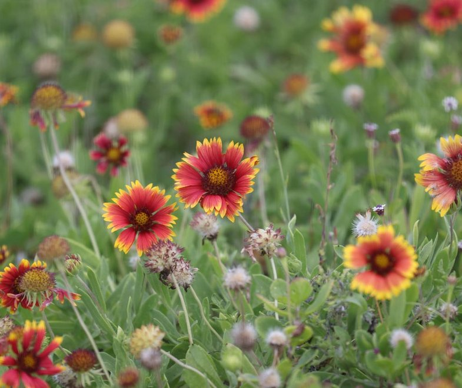

# Astro-Codex NASA
Su desafío es aprovechar el poder de los datos de observación de la Tierra de la NASA para desarrollar una herramienta que monitoree y visualice eventos de floración de plantas en todo el mundo o dentro de una región local específica, y aborda directamente una necesidad específica de monitoreo de vegetación, predicción o gestión en la escala elegida.
 
 [BloomWatch NASA](https://www.spaceappschallenge.org/2025/challenges/bloomwatch-an-earth-observation-application-for-global-flowering-phenology/?tab=details)
 
 
 
 ---
 
 ## Tareas para la semana del 18 al 21
 
 | Tarea                                                | Responsable | Estado  |
 |------------------------------------------------------|-------------|---------|
 | Diseño web en Figma                                  |    Amy      |         |
 | Mapa con geometria y cordenadas en web               |   Félix     |         |
 | Imagenes de Google Earth Engine                      |   Emanuel   |         |
 | Imagenes de la Nasa                                  |   Didier    |         |
 | Formulas con codigo para detectar polen, y fenologías|   Sofi      |         |
 | Información sobre la fenología del Maíz              |   Mary      |         |
 
 ---
 
 ## Notas adicionales
 - Guia para trabajar en colab desde GitHub [Colab](/pages/GuiaColab)

